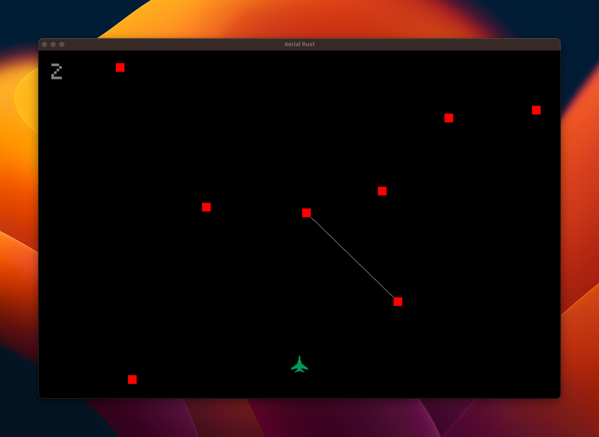

# Rust Stuff

Stuff I wrote in Rust.

## Credits Manager

A gRPC microservice for managing credits. It can topup, consume, and get the balance of credits for a given user. Runs in Docker, requires connection to a Postgres DB.

## Aerial Game

An aerial game written in Rust, using the SDL2 library. Requires installing SDl2 C libraries.

